# B2CViz

B2CViz is an R package for bin2cell or Spaceranger processed VisiumHD spatial single-cell data, including ROI selection, multi-feature plotting, quantification, and neighborhood analysis. Figures presented in this page were generated with Bin2cell and B2CViz using data from [10x genomics](https://www.10xgenomics.com/datasets/visium-hd-cytassist-gene-expression-libraries-human-breast-cancer-ff-ultima)

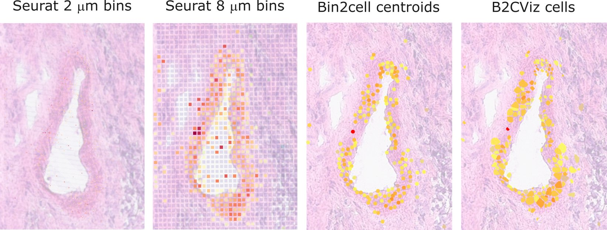

## Installation

You can install the development version of B2CViz from Gitlab with:

``` r
install.packages("devtools")
devtools::install_gitlab("vroh/B2CViz")
```

B2CViz depends on the following packages: `jpeg`, `png`, `tiff`, `Seurat`, `dplyr`, `ggplot2`, `ggrepel`, `imager`, `shiny`, `ggnewscale`, `tidyr`, `FNN`, `purrr`, `scales`, `httpuv`

The `upscale_roi` function additionally requires `RBioFormats` (Bioconductor) and an original OME-TIFF image.

Optional neighborhood analysis functions require Bioconductor packages: `SpatialExperiment`, `hoodscanR`, `SingleCellExperiment`, `circlize`, `ComplexHeatmap`. Install with:

``` r
BiocManager::install(c("SpatialExperiment", "hoodscanR", "SingleCellExperiment",
                       "circlize", "ComplexHeatmap"))
```

## Preprocessing

Initial versions of B2CViz required objects that have been preprocessed by [Bin2cell](https://github.com/Teichlab/bin2cell). Two objects are required, the first one corresponds to the pre-aggregated object (generated after the `b2c.expand_labels` step), while the second is the final aggregated object (after `b2c.bin_to_cell`). Both anndata objects are converted using [sceasy](https://github.com/cellgeni/sceasy) and the following function:

``` r
#devtools::install_github("cellgeni/sceasy")
library(reticulate)
library(sceasy)
obj <- convertFormat(obj = "/path/to/obj.h5ad",
                     from="anndata",
                     to="seurat",
                     outFile='/path/to/obj.rds')
```

Since January 2026, objects that have been segmented directly with Spaceranger can also be used (see how to use them below).

## Visualization

To visualize data, load the objects, select a region of interest, crop it, and call the plotting functions

``` r
library(B2CViz)
library(Seurat)
object_pre <- readRDS("/path/to/seurat_object.rds")
object_post <- readRDS("/path/to/seurat_object.rds")
image_path <- "/path/to/image.jpg"

# Normalize bin2cell data
object_post <- NormalizeData(object_post)

# create bin2cell object (works with jpg or png, provide path to image used for bin2cell)
b2c <- load_b2c(pre = object_pre, post = object_post, path = image_path)
```

If you are using data directly segmented by Spaceranger, you can load them as follows

``` r
# Specify the path to your Spaceranger outputs
data.dir <- "/path/to/outs/"
# Choose which data slice to use
slice <- "slice1"

# Load the Visium HD dataset with segmentations
obj <- Load10X_Spatial(
  data.dir = data.dir,
  slice = slice,
  bin.size = c("polygons")
)

# The scaling factor is required. For example, when using spaceranger's hires scale it is reported here:
sf <- obj@images[[paste0(slice, ".polygons")]]@scale.factors$hires

# Create a bin2cell (B2C) object, note that the `pre` argument is not required when using spaceranger data
image_path <- "/path/to/outs/segmented_outputs/spatial/tissue_hires_image.png"
b2c <- load_b2c(post = obj, path = image_path, data = "spaceranger", slice = slice, scale.factor = sf)

# normalize with NormalizeData or SCTransform (though latter probably better)
b2c$post <- NormalizeData(b2c$post)
```

You can use Spaceranger's hires image as input, though I would recommend to generate a higher definition image. If you have massive OME-TIFF files, you can prepare jpgs of manageable size using [OT-LIP](https://gitlab.com/vroh/ot-lip). Record the scale factor used, it is required by the `load_b2c` function.

### Overview

``` r
# plot overview
b2c <- scaledown_img(b2c = b2c)
overview_b2c(b2c = b2c, feat = "CDH1")
```

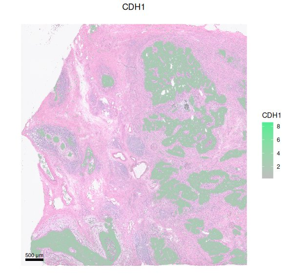

### ROI selection

Select your region of interest using `set_roi()` function. Draw rectangles or polygons and add the ROIs to the b2c object

``` r
# set region of interest
b2c <- set_roi(b2c = b2c)

# crop b2c object using ROI limits
b2c_1 <- crop_b2c(b2c, roi = 1)
b2c_2 <- crop_b2c(b2c, roi = 2)
```

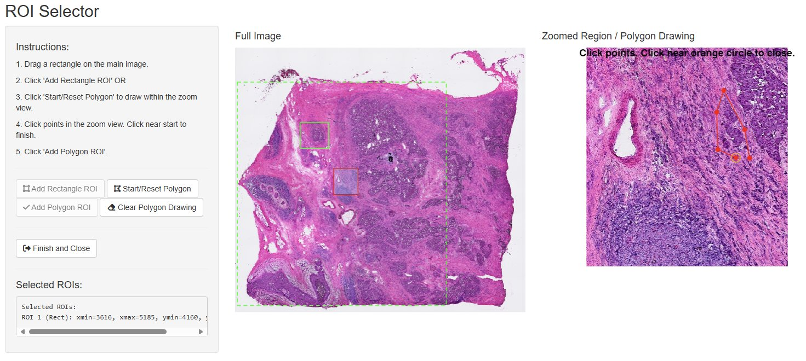

Eventually, the tissue image can be replaced by the same ROI area extracted from the original OME-TIFF image for best quality results

``` r
# replace image with original high-resolution image
b2c_1 <- upscale_roi(b2c_1, "/path/to/original_OME.tiff")
b2c_2 <- upscale_roi(b2c_2, "/path/to/original_OME.tiff")
```

### Segmentation plot

You can inspect the segmentation results by running

``` r
plot_segmentation(b2c = b2c_1)
```

### Feature plot

The default feature plot function is `plot_b2c`

``` r
plot_b2c(b2c = b2c_1, feat = "CDH1")
plot_b2c(b2c = b2c_2, feat = "CDH1")
```


### Adjust cells transparency

Set alpha.low to a value above 0 to show all cells with positive feature counts

``` r
plot_b2c(b2c = b2c_1, feat = "CDH1", alpha.low = 0.1)
```

### Adjust color gradient scale

Provide a list of vectors to adjust the minimum and maximum values of each color scale

``` r
plot_b2c(b2c = b2c_1, feat = "CDH1", scale.min.max = list(c(0,3)))
```

### Threshold for cells displayed

Adjust min.visible to only show cells that have feature counts above the desired threshold

``` r
plot_b2c(b2c = b2c_1, feat = "CDH1", alpha.low = 0.1, min.visible = 3)
```

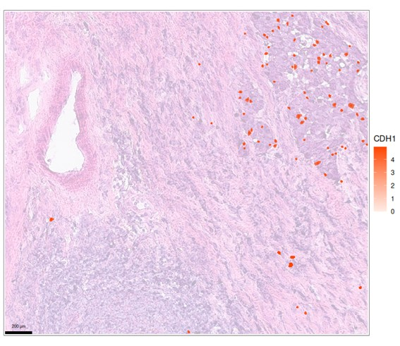

### H&E visibility adjustments

Adjust the visibility of the displayed H&E picture with he_alpha

``` r
plot_b2c(b2c = b2c_1, feat = "CDH1", alpha.low = 0.1, min.visible = 2, he_alpha = 0.1)
```

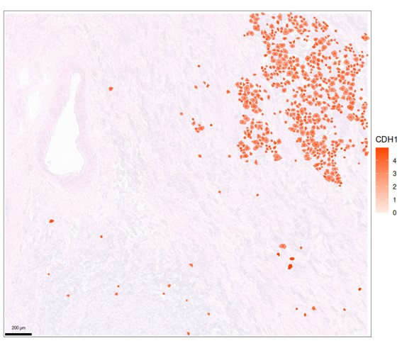

### Cells display format

Choose between points (bin2cell centroids), hulls (cells) or a combination of the two

``` r
plot_b2c(b2c = b2c_1, feat = "CDH1", plot.type = "points")
```

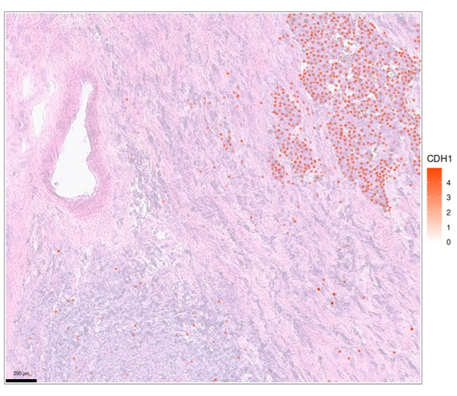

### Gradient representation

Differentiate level of counts with a gradient of 2 colors instead of transparency

``` r
plot_b2c(b2c = b2c_1, feat = "CDH1", col.low = "blue", col.mid = "white", col.high = "red", alpha.low = 1, alpha.mid = 1)
```

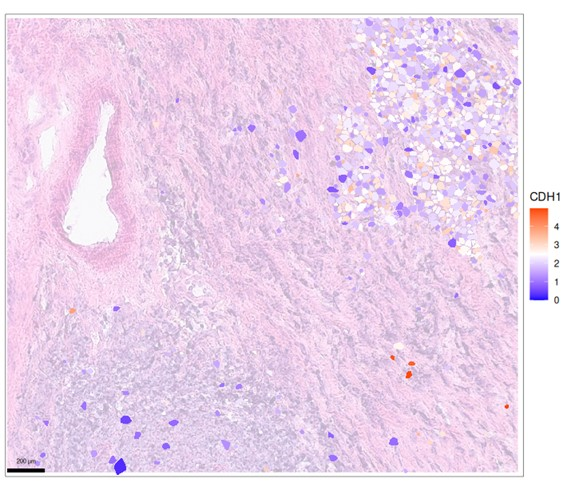

### Labels

Show labels if you need to identify cells of interest (slow and overcrowded if too many cells are displayed, so keep the number of cells low!)

``` r
plot_b2c(b2c = b2c_1, feat = "CDH1", min.visible = 3.5, show.labels = T)
```

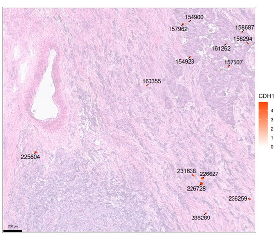

### Highlight cells of interest

``` r
plot_b2c(b2c = b2c_1, feat = "CDH1", outline.hulls = c(154900, 157962, 157507))
```

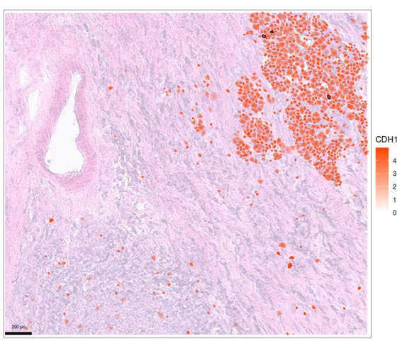

### Pre-filter to only keep cells of interest

You can select features and threshold expression levels to be used for data pre-filtering. If using multiple features, add them in lists of vectors in the same order than the feat parameter. Filters for multiple features are combined according to `filter.type` which can be either in `or` mode (default) or `and` mode.

``` r
plot_b2c(b2c = b2c_1, feat = "CDH1", filter.feat = "CLU", filter.threshold = 5)
plot_b2c(b2c = b2c_1, feat = "CDH1", filter.feat = list(c("CLU", "EPCAM")), filter.threshold = list(c(5, 2)))
```

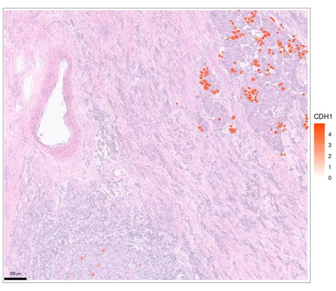

### Multiple features

You can plot multiple features, in that case provide a set of colors (matching the number of features)

``` r
plot_b2c(b2c_1, c("CDH1", "CD19", "COL1A1", "MYH11"), plot.type = "hulls", col.high = c("dodgerblue", "orangered", "gold", "seagreen"), he_alpha = 0.3)
```

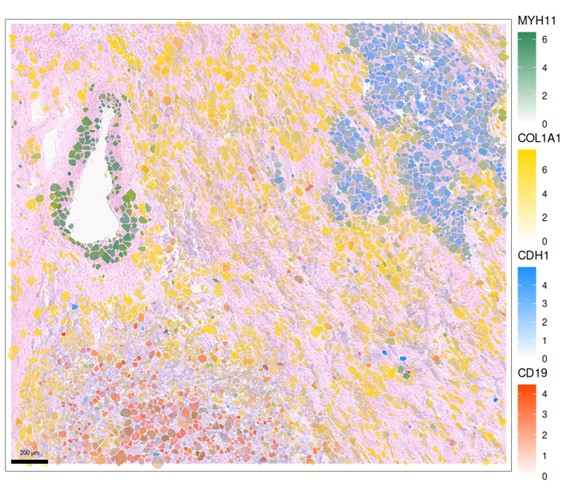

If multiple features overlap a lot, it can be better to use centroids representation only to identify multi-positive cells more easily

``` r
plot_b2c(b2c_1, c("CD3E", "CD4"), plot.type = "points", col.high = c("dodgerblue", "orangered"))
```

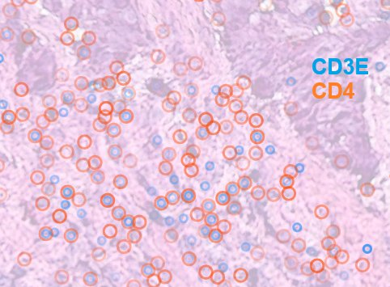

min.visible, alpha.low, alpha.mid and alpha.high can be provided as vector when plotting multiple features to adjust parameters for each feature independently

``` r
plot_b2c(b2c = b2c_1, feat = c("CDH1", "CD4"), min.visible = c(2, 2.5), col.high = c("orangered", "seagreen2"))
```

You can also pass discrete variables in the `feat` argument (in that case, one feature only), every level will be displayed by a different color (you can set yours in the `col.discrete` argument)

``` r
plot_b2c(b2c = b2c_1, feat = c("seurat_clusters"), plot.type = "hulls", discrete.alpha = 0.8)
```

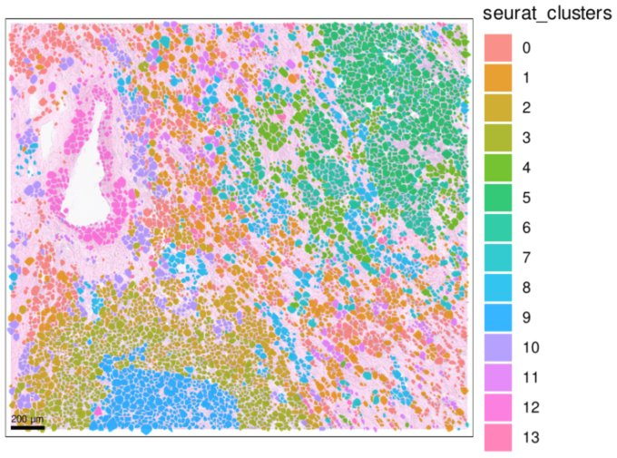

## Quantification

### Cell-cell distances

Save the plot in a variable to compute cell-cell distances. `get_dist()` returns a **list** with two elements:
- `$distances`: a data frame of all pairwise origin–neighbor pairs within the radius, with columns `origin_name`, `origin_marker`, `origin_value`, `neighbor_name`, `neighbor_marker`, `neighbor_value`, `distance`
- `$locations`: a data frame of all displayed cells with columns `cell_id`, `x`, `y`

The `step` element in the `plot_b2c` return value gives the median 2 µm step size (in plot coordinates), which is required to scale distances back to microns.

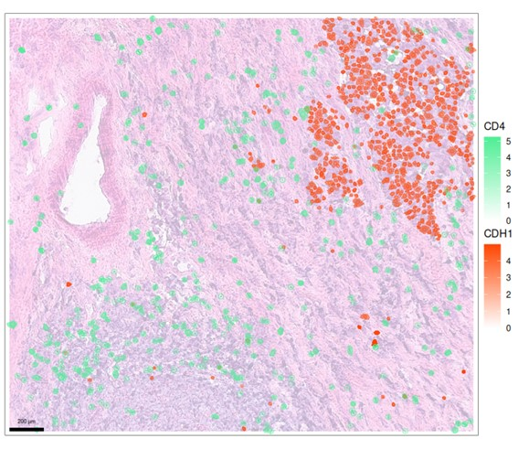

``` r
p <- plot_b2c(b2c = b2c_1, feat = c("CDH1", "CD4"), min.visible = c(2, 2.5), plot = FALSE)
output_data <- get_dist(p, radius = 1000)

# p$step holds the median nearest-neighbour step size (used downstream to convert to microns)
```

You can then plot the distribution of the distances with `plot_dist()`

``` r
plot_dist(output_data$distances, binwidth = 20)
```

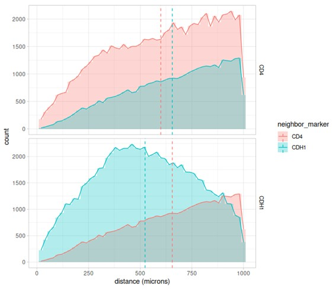

### Neighborhood analysis pipeline

B2CViz provides a full radius-based neighborhood analysis pipeline. The typical workflow is to collect `get_dist()` outputs from multiple ROIs and/or conditions, combine them into a single annotated table, and run the pipeline.

``` r
# Run get_dist() for each ROI (plot = FALSE forces coordinate translation off)
p1 <- plot_b2c(b2c = b2c_1, feat = c("CDH1", "seurat_clusters"), plot = FALSE)
p2 <- plot_b2c(b2c = b2c_2, feat = c("CDH1", "seurat_clusters"), plot = FALSE)

d1 <- get_dist(p1, radius = 500)
d2 <- get_dist(p2, radius = 500)

# Annotate each result with ROI and group labels, then combine
d1$distances$roi   <- "roi_1"
d1$distances$group <- "tumor"
d2$distances$roi   <- "roi_2"
d2$distances$group <- "stroma"

combined <- rbind(d1$distances, d2$distances)

# Standardize column names to the canonical format
edges <- standardize_get_dist(combined,
                              origin_type_col  = "origin_value",
                              neighbor_type_col = "neighbor_value")

# Run the full pipeline (mean_step from p$step rescales distance breaks to microns)
res <- run_full_pipeline(edges, mean_step = p1$step)

# Optionally rescale all distance columns back to microns
res <- rescale_res_distances(res, factor = p1$step)
```

The pipeline returns a named list with:
- `$qc`: basic sanity checks on the edge table
- `$pair_stats`: per-ROI pairwise neighborhood statistics (edge counts, enrichment, distance summaries)
- `$radial_stats`: per-ROI radial distance-bin profiles
- `$cumulative_stats`: cumulative neighbor counts at a series of radii
- `$group_pair_stats`: cross-ROI group-level summaries
- `$cells`: cell-type abundance table derived from origin cells

#### Comparing groups

``` r
# Wilcoxon test comparing two groups across all cell-type pairs
cmp <- compare_groups(res$pair_stats, metric = "mean_neighbors_per_origin",
                      group_a = "tumor", group_b = "stroma")
head(cmp)
```

#### Plotting results

``` r
# Dot-plot: mean neighbors per origin for a focal cell type, faceted by neighbor type
plot_stats(res, table = "pair_stats", focus = "Tumor",
           x = "group", y = "mean_neighbors_per_origin",
           facet_y = "neighbor_type", group = "group")

# Radial profile across distance bins
plot_stats(res, table = "radial_stats", focus = "Tumor",
           x = "dist_bin", y = "mean_neighbors_per_origin_bin",
           facet_y = "neighbor_type", group = "group")

# Heatmap of group-level means (requires ComplexHeatmap)
plot_hm(res, focus = "Tumor", metric = "mean_neighbors_per_origin_mean")

# 2-D neighbor density map centered on a focal origin type
plot_density(list(roi_1 = d1), roi = "roi_1",
             origin = "Tumor", neighbor = "T cell", n = 50)
```

#### Handling ROI border effects

Origin cells close to the ROI edge may have incomplete neighbor spheres. Use `trim_origins_by_border()` to restrict analysis to cells whose full neighborhood fits within the ROI, or pass `border_trim = TRUE` to `run_full_pipeline()`:

``` r
roi_windows <- data.frame(roi = "roi_1", xmin = 0, xmax = 2000, ymin = 0, ymax = 2000)

res <- run_full_pipeline(edges, mean_step = p1$step,
                         border_trim = TRUE,
                         coords = d1$locations,
                         roi_windows = roi_windows)
```

## hoodscanR / Statial integration

B2CViz objects can be converted to a `SpatialExperiment` for downstream analysis with [hoodscanR](https://bioconductor.org/packages/hoodscanR) or [Statial](https://bioconductor.org/packages/Statial).

``` r
# Convert the post-aggregation Seurat object to a SpatialExperiment
# annot_col is the metadata column containing cell type labels
spe <- b2c_to_hood(b2c_1$post, annot_col = "seurat_clusters")

# Run the full hoodscanR neighborhood probability pipeline
# and return a cell-type co-localization correlation matrix
cor_mat <- get_cor_hood(spe, k = 100)

# Extract the upper triangle as a tidy data frame
upper_df <- get_upper(cor_mat)

# Focal neighborhood plot: visualize co-localization of one cell type with all others
# across samples/conditions stored in an edge table
plot_hood_focal(edge_df = upper_df, focus = "Tumor",
                x = "sample", metric = "r",
                facet_y = "celltype2", group = "condition")

# Convert an edge table back to a symmetric matrix (e.g. for heatmaps)
mat <- edge_table_to_matrix(upper_df, value_col = "r")
```
